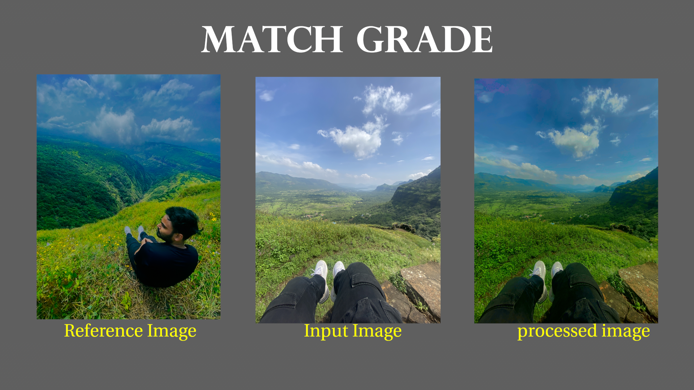

# Match Grade

## Overview



Match Grade is an advanced image processing tool for transferring color grading from a reference image to an input image using histogram matching and style transfer. Built with Flask and OpenCV, it provides an intuitive interface with a modern UI for seamless image enhancement.
Match Grade is a Flask-based web application that allows users to match the color grading of an input image with a reference image. It applies histogram matching and style transfer techniques to generate a color-graded output.

## Features

- Upload **Reference Image** and **Input Image**
- **Histogram Matching** for accurate color transfer
- **Style Transfer** to blend features from the reference image
- **Download the processed image**
- **Modern UI** with a moving GIF background

## Folder Structure

```
Match_Grade/
│── app.py                # Flask backend
│── __init__.py           # Package initializer
│── helpers.py            # Utility functions for image handling
│── histogram_match.py    # Color grading using histogram matching
│── style_transfer.py     # Style transfer implementation
│── requirements.txt      # Project dependencies
│── static/               # Static files (CSS, Images, GIFs)
│   ├── styles.css        # Stylesheet
│   ├── bg.gif            # Animated background
│   ├── uploads/          # Uploaded images
│   ├── processed/        # Processed images
│── templates/            # HTML templates
│   ├── index.html        # Main UI
│── README.md             # Project documentation
```

## Installation & Setup

### Prerequisites

- Python 3.8+
- pip

### Install Dependencies

```sh
pip install -r requirements.txt
```

### Run the Application

```sh
python app.py
```

### Usage

1. Open `http://127.0.0.1:5000/` in your browser.
2. Upload a **Reference Image** and **Input Image**.
3. Click **Generate Image**.
4. View and download the processed image.

## Technologies Used

- **Flask** (Python Web Framework)
- **OpenCV** (Image Processing)
- **NumPy** (Array Operations)
- **HTML, CSS** (Frontend UI)

## License

This project is open-source and available for modification and distribution.

